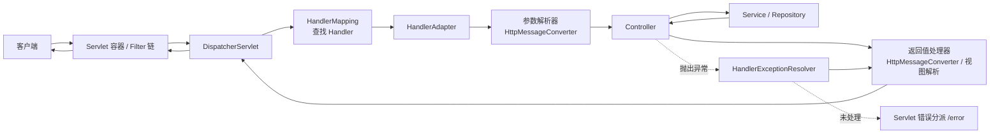

# Spring Boot 4 总结(未完结)

> B站视频: 【SpringBoot4从入门到精通，适合小白的SpringBoot4视频教程】https://www.bilibili.com/video/BV1iykjB1Ewc?p=71&vd_source=d5a73cbf63be82bcd42f6a9334c817b2
>
> 第71集

> 全文分两大部分:**一、Spring 容器与 Bean**(注解、注册、启动回调)——讲「类怎么变成 Bean、怎么被管理」;**二、Spring MVC Web**(请求流程、参数、响应、异常)——讲「一个 HTTP 请求进来后怎么被处理」。

> **实战标注说明**:部分章节开头带一个提示块,标明该内容在实际项目里的地位,便于复习时分清主次:
>
> - 🟢 **实战常用**:日常开发天天写,必须掌握。
> - 🟡 **原理向**:框架自动处理,开发者不手写;懂原理有助排错和面试,但代码里碰不到。
> - 🟠 **有现代替代 / 二选一**:能用,但有更主流的方案,或存在竞争选型,需按场景取舍。
> - 🔴 **少用 / 已过时**:实战很少用,或已被新方案取代,了解即可。
>
> **代码示例说明**:包含 `...` 或只展示方法/表达式的代码块是为了突出 API 用法的片段,不是可直接编译的完整 Java 文件;完整项目还需要补充类、方法体和 import。

# 一、Spring 容器与 Bean

## 构造型注解(Stereotype Annotations)

这类注解核心都是 `@Component` 的衍生,作用是把类注册为 Spring 容器管理的 Bean,同时表达它在架构里的「角色」。它们通过**元注解组合**建立关系,不是 Java 类继承。

### 核心四个

| 注解          | 所在层      | 特殊功能(除了注册 Bean)                                                            |
| ------------- | ----------- | ---------------------------------------------------------------------------------- |
| `@Component`  | 通用        | 最基础的标记,其他三个都是它的特化                                                  |
| `@Repository` | 持久层(DAO) | **异常转换标记**:配合异常转换后置处理器,把原生持久化异常转成 `DataAccessException` |
| `@Service`    | 业务层      | 无额外功能,纯语义化标记                                                            |
| `@Controller` | 表现层      | 配合 `@RequestMapping` 处理 Web 请求,返回视图                                      |

它们的元注解组合关系如下:

```text
@Component
├── @Repository
├── @Service
└── @Controller
    └── @RestController  (= @Controller + @ResponseBody)
```

### @Repository 详解

`@Repository` 标注在数据访问层(DAO/持久层)的类上,有三个作用:

1. **声明为 Spring Bean**:是 `@Component` 的特化,会在组件扫描时自动注册为 Bean,可被 `@Autowired` 注入。
2. **作为异常转换标记**:当容器中注册了 `PersistenceExceptionTranslationPostProcessor` 和对应的 `PersistenceExceptionTranslator` 时,带 `@Repository` 的 Bean 才会被代理,并把 JPA/Hibernate 等原生持久化异常转换为 Spring 的 `DataAccessException` 体系。`@Repository` 本身只是让该 Bean 具备被转换的资格。
   - `JdbcTemplate` 自身已经负责把 `SQLException` 转成 `DataAccessException`,不依赖给调用它的 DAO 再加代理才能完成这一步。
3. **语义化/分层清晰**:明确表达「这个类属于持久层」。

**Spring Data JPA 注意**:继承 `JpaRepository`/`CrudRepository` 的接口**不需要**手动加 `@Repository`,Spring Data 会自动生成并注册代理。手写 DAO 类时通常使用 `@Repository` 来同时完成组件扫描和异常转换标记;如果已经通过 `@Bean` 等方式注册,则是否需要它取决于是否还需要这层异常转换语义。

```java
// 不需要 @Repository,Spring Data 自动处理
public interface UserRepository extends JpaRepository<User, Long> {
}
```

### Web 相关的衍生

```java
@RestController         // @Controller + @ResponseBody,返回 JSON/数据而非视图
```

用在写 REST API 的场景,方法返回值直接序列化成响应体(通常是 JSON),不走视图解析。前后端分离项目最常用。

### 配置类相关

不属于「业务分层」构造型,但同样会被扫描注册:

| 注解             | 作用                                                                                                       |
| ---------------- | ---------------------------------------------------------------------------------------------------------- |
| `@Configuration` | 标记配置类,内部可用 `@Bean` 方法定义 Bean(本质也是 `@Component` 特化)                                      |
| `@Bean`          | 方法级注解,把方法返回值注册为 Bean;通常放在 `@Configuration` 类里,也可在其他 Spring 组件中以 lite 模式使用 |
| `@ComponentScan` | 指定扫描哪些包下的构造型注解                                                                               |

### 关键区别与选用

- **功能上**:除了 `@Repository`(异常转换)和 `@Controller`/`@RestController`(Web 处理)有实际额外行为,`@Service` 和 `@Component` 本身**没有任何功能差异**,注册出来的 Bean 完全一样。
- **为什么还要分**:
  - 语义清晰,一眼看出类属于哪一层
  - 便于 AOP 按注解切面(比如只对 `@Service` 做事务或日志)
  - 框架未来可能针对特定注解增强(`@Repository` 就是例子)
- **选用原则**:按类的实际职责选对应的层,不要图省事全用 `@Component`。

### 容易混淆的点

`@Autowired`、`@Resource` 是依赖注入注解,用于注入 Bean;`@Value` 主要注入配置属性或 SpEL 表达式结果。它们都不是构造型注解——构造型注解负责「把类注册成 Bean」。业务代码优先使用构造器注入;类只有一个构造器时不必再写 `@Autowired`:

```java
@Service                // 构造型:我是一个 Bean
public class UserService {
    private final UserRepository userRepository;

    public UserService(UserRepository userRepository) {
        this.userRepository = userRepository;
    }
}
```

## BeanRegistrar(编程式注册 Bean)

> 🔴 **少用 / 有替代**:业务开发几乎碰不到,主要是**框架/中间件/starter 作者**做动态装配时用。普通项目用 `@Configuration` + `@Bean` 就够了。文末「和 @Bean / @Component 怎么选」里的 `BeanDefinitionRegistryPostProcessor` 更是几乎不用。

> ⚠️ 注意:Spring Boot 4 里**没有** `@BeanRegister` 这个注解。相关新特性是 **`BeanRegistrar` 接口**——它由 Spring Framework 7 引入,是 Boot 4 所使用的编程式 Bean 注册机制。
>
> 下面的 API 形状(`BeanRegistry` 的方法名、spec lambda 参数)可在官方文档核对:<https://docs.spring.io/spring-framework/reference/core/beans/java/programmatic-bean-registration.html>

### 它解决什么问题

在它之前注册 Bean 主要两条路:

- **声明式**:`@Component` 扫描、`@Bean` 方法——简单,但都是静态声明。
- **底层 API**:实现 `BeanDefinitionRegistryPostProcessor`,手动拼 `BeanDefinition`——灵活但啰嗦易错。

`BeanRegistrar` 是两者的折中:**用编程逻辑动态决定注册哪些 Bean,但 API 比手写 `BeanDefinition` 干净得多**,还能拿到 `Environment` 做条件判断。典型场景是按环境/配置动态生成一批 Bean(库作者、框架整合常用)。它对 GraalVM 原生镜像(AOT)也友好,这是新版本推它的原因之一。

### 基本用法

实现 `BeanRegistrar` 的 `register` 方法:

```java
public class MyBeanRegistrar implements BeanRegistrar {

    @Override
    public void register(BeanRegistry registry, Environment env) {
        // 注册一个简单 Bean
        registry.registerBean("myService", MyService.class);

        // 带定制的注册(作用域、懒加载、构造参数等)
        registry.registerBean("fooService", FooService.class, spec -> spec
            .prototype()
            .lazyInit()
            .supplier(context -> new FooService(context.bean(MyService.class))));

        // 按环境条件决定是否注册
        if (env.matchesProfiles("dev")) {
            registry.registerBean("devTool", DevTool.class);
        }
    }
}
```

再用 `@Import` 引入:

```java
@Configuration
@Import(MyBeanRegistrar.class)
public class AppConfig {
}
```

### 要点

- `BeanRegistry` 提供 `registerBean(...)` 系列方法,通过 lambda(spec/customizer)配置作用域(singleton/prototype)、懒加载、构造参数、依赖等,相当于流式组装 `BeanDefinition`。
- `register` 能拿到 `Environment`,可做 profile、配置项判断,这是比纯 `@Bean` 灵活的地方。
- AOT 友好,编程式注册信息能在 AOT 阶段被正确处理。
- Kotlin 有对应 DSL 写法,更简洁。

### 和 @Bean / @Component 怎么选

| 场景                                 | 推荐                                  |
| ------------------------------------ | ------------------------------------- |
| 自己的普通类                         | `@Component`                          |
| 第三方类、简单定制                   | `@Bean`                               |
| 需要**按逻辑/环境动态**注册一批 Bean | `BeanRegistrar`                       |
| 极底层控制(几乎不用了)               | `BeanDefinitionRegistryPostProcessor` |

## 自定义初始化逻辑

`ApplicationRunner` 和 `CommandLineRunner` 是 Spring Boot 提供的两个启动回调接口,用于在 `SpringApplication.run(...)` 返回前执行启动任务。Spring Boot 会在所有 Runner 执行完后发布 `ApplicationReadyEvent`,并把就绪状态切换为可接收流量。两者主要区别在于「怎么接收命令行参数」。

- `CommandLineRunner` 参数:`String... args` 原始字符串数组
- `ApplicationRunner` 参数:`ApplicationArguments` 封装对象

可以通过 `@Order(2)` 注解或者实现 `Ordered` 接口,决定多个 Runner 的执行顺序。

# 二、Spring MVC Web

## Spring MVC 请求执行流程

下面是整个 Web 部分的总纲:一个请求从 Servlet 容器进入 `DispatcherServlet`,经过 Handler 查找、参数解析、Controller 调用、返回值处理或异常解析后生成响应。后面的「请求参数」「@RequestBody / @ResponseBody 原理」「异常处理」各章,讲的都是其中某一个环节。



## 请求地址通配符

> 🟢 **实战常用**(`{name}` 路径变量、`**` 通配)。但 🔴 `AntPathMatcher` 已是老方案:Spring 6 / Boot 3+ 默认已切到 `PathPattern`,除非维护老项目,只需记 `PathPattern`(它才支持 `{*name}` 捕获剩余路径)。

`@RequestMapping` 及其派生注解(`@GetMapping` 等)的路径支持通配符,由 Spring 的 `AntPathMatcher`(传统)/ `PathPattern`(Spring 5.3+ WebFlux 及新版 MVC 默认)解析。

| 通配符        | 含义                                       | 示例              | 能匹配                            | 不能匹配           |
| ------------- | ------------------------------------------ | ----------------- | --------------------------------- | ------------------ |
| `?`           | 匹配**单个字符**                           | `/user/t?st`      | `/user/test`、`/user/tXst`        | `/user/teest`      |
| `*`           | 匹配**同一层路径**里任意数量字符(不跨 `/`) | `/user/*.html`    | `/user/a.html`                    | `/user/sub/a.html` |
| `**`          | 匹配**任意多层路径**(跨 `/`)               | `/user/**`        | `/user`、`/user/a`、`/user/a/b/c` | —                  |
| `{name}`      | 路径变量,配合 `@PathVariable` 取值         | `/user/{id}`      | `/user/123`(id=123)               | `/user/1/2`        |
| `{name:正则}` | 带正则约束的路径变量                       | `/user/{id:\\d+}` | `/user/123`                       | `/user/abc`        |
| `{*name}`     | 捕获**剩余多层路径**到变量(PathPattern)    | `/files/{*path}`  | `/files/a/b.txt`(path=`/a/b.txt`) | —                  |

```java
@GetMapping("/user/{id:\\d+}")           // id 只能是数字
public User get(@PathVariable Long id) { ... }

@GetMapping("/files/{*path}")            // 把后面所有层级抓成一个变量
public Resource file(@PathVariable String path) { ... }

@GetMapping("/static/**")                // 匹配 /static 下任意深度
public void anyStatic() { ... }
```

**要点**:

- 在 Spring 7 的 `PathPattern` 中,一个模式最多只能出现一个 `**` 或 `{*name}`,并且只能放在模式开头或末尾,不能放在中间;非法模式会在解析阶段直接报错。
- 多个模式都能匹配同一请求时,Spring 使用具体度比较器选择。catch-all 模式优先级最低;其他模式通常先比较 URI 变量与通配符数量,再比较路径长度等条件,不要只把它简化成固定的 `精确 > * > **` 三档规则。
- 新版本(基于 `PathPattern`)性能更好,且 `{*name}` 这种「捕获剩余路径」的写法只有 `PathPattern` 支持。

## 请求参数

Spring MVC 的 Controller 方法参数非常灵活:既能直接声明**原生 Servlet 对象**拿到最底层的请求信息,也能用**注解**让 Spring 帮你把参数自动解析、类型转换后注入。实战优先用注解,原生对象只在需要底层控制时用。

### 一、原生请求 / 响应对象

> 🟡 **原理向 / 少用**:文档下文也标注了「不建议」。样板代码多、难做单元测试。实战几乎全用注解(见「四」),要读请求头用 `@RequestHeader` 而非掏 `HttpServletRequest`。只有网关、raw body 验签、流式处理等少数底层场景才直接声明原生对象。

层层继承的体系(Servlet 规范打底 → HTTP 特化 → 文件上传扩展):

```text
ServletRequest (协议无关底层)
   └── HttpServletRequest (HTTP 特化,最常用)
          └── MultipartHttpServletRequest (再加文件上传能力)
MultipartRequest (Spring 定义的「文件上传能力」接口)
   └──────────────┘ 被 MultipartHttpServletRequest 一并继承
```

| 对象                                         | 定义方       | 作用                                                                     |
| -------------------------------------------- | ------------ | ------------------------------------------------------------------------ |
| `ServletRequest` / `ServletResponse`         | Servlet 规范 | 最底层、协议无关。`getParameter()`、`getInputStream()`、`getWriter()` 等 |
| `HttpServletRequest` / `HttpServletResponse` | Servlet 规范 | HTTP 特化。请求头、Cookie、Session、状态码、重定向等                     |
| `MultipartRequest`                           | Spring       | 只声明文件上传方法:`getFile()`、`getFileMap()` 等                        |
| `MultipartHttpServletRequest`                | Spring       | HTTP 能力 + 文件上传能力的合体,处理 `multipart/form-data` 时用           |

```java
@GetMapping("/info")
public void info(HttpServletRequest request, HttpServletResponse response) {
    String ua = request.getHeader("User-Agent");   // HTTP 能力
    response.setStatus(200);
}

@PostMapping("/upload")
public String upload(MultipartHttpServletRequest request) {
    MultipartFile file = request.getFile("avatar");     // 文件能力
    String token = request.getHeader("Authorization");  // 同时还有 HTTP 能力
    return "ok";
}
```

**什么时候用**:大多数情况**不建议**直接用这些原生对象(样板代码多)。只有需要动态处理不定数量的文件、或要拿一堆底层信息时才直接声明。

### 二、Session

> 🟠 **按认证架构选用**:严格的 REST API 强调请求自包含,常使用 JWT 或 opaque token;但“前后端分离”不等于必须使用 JWT。浏览器应用也可以使用服务端 Session + 安全 Cookie。选择时应结合撤销需求、集群部署、CSRF/XSS 防护和客户端类型。

| 对象          | 作用                                                                             |
| ------------- | -------------------------------------------------------------------------------- |
| `HttpSession` | 服务端会话对象,跨请求保存用户状态(如登录信息)。底层靠 Cookie 里的 SessionID 识别 |

```java
@PostMapping("/login")
public String login(HttpSession session, @RequestParam String name) {
    session.setAttribute("user", name);   // 存进 Session
    return "logged in";
}

@GetMapping("/me")
public String me(HttpSession session) {
    return (String) session.getAttribute("user");
}
```

分布式/集群下把 Session 只存在单机内存会有问题,可用 **Spring Session + Redis/JDBC** 共享。Spring Session 会透明替换 `HttpSession` 的底层实现,业务代码仍然可以使用 `HttpSession` API;另一条路线是采用不依赖服务端会话的 token 方案。

### 三、Servlet API 原生请求体流

> 🟡 **原理向 / 少用**:有 `@RequestBody` 自动反序列化 JSON,基本用不到手动读写流。只有处理非标准格式、超大文件流式传输、或需完全自控读写时才碰。

| 对象                      | 作用                                   |
| ------------------------- | -------------------------------------- |
| `Reader`                  | 以字符流读请求体(文本)                 |
| `InputStream`             | 以字节流读请求体(二进制)               |
| `Writer` / `OutputStream` | 直接往响应体写数据,绕过视图/消息转换器 |

```java
@PostMapping("/raw")
public void raw(Reader reader, Writer writer) throws IOException {
    // 手动读原始请求体、手动写响应
}
```

**什么时候用**:需要完全自己控制读写、处理非标准格式时。有 `@RequestBody` 能自动反序列化 JSON 的话,基本用不到这些。

### 四、Spring MVC 提供的注解(实战首选)

| 注解             | 取值来源                     | 典型场景                       |
| ---------------- | ---------------------------- | ------------------------------ |
| `@PathVariable`  | URL 路径里的占位符 `{}`      | RESTful 风格,资源 id 在路径里  |
| `@RequestParam`  | 查询串 `?k=v` 或表单字段     | 普通查询/表单参数              |
| `@RequestHeader` | 请求头                       | 读取 token、User-Agent、语言等 |
| `@RequestBody`   | 请求体整体(通常 JSON)        | 前后端分离,接收 JSON 对象      |
| `@RequestPart`   | `multipart` 请求里的某一部分 | 文件上传 + 同时带 JSON 部分    |

```java
// @PathVariable —— /user/123
@GetMapping("/user/{id}")
public User get(@PathVariable Long id) { ... }

// @RequestParam —— /search?keyword=abc&page=2
@GetMapping("/search")
public List<Item> search(@RequestParam String keyword,
                         @RequestParam(defaultValue = "1") int page) { ... }

// @RequestHeader
@GetMapping("/who")
public String who(@RequestHeader("Authorization") String token) { ... }

// @RequestBody —— 接收 JSON,自动反序列化成对象
@PostMapping("/user")
public User add(@RequestBody UserDto dto) { ... }

// @RequestPart —— 文件 + JSON 混合的 multipart 请求
@PostMapping("/upload")
public String upload(@RequestPart("file") MultipartFile file,
                     @RequestPart("meta") UserDto meta) { ... }
```

### 怎么选(核心)

| 需求                                | 用哪个                                               |
| ----------------------------------- | ---------------------------------------------------- |
| id / 资源标识在**路径**里           | `@PathVariable`                                      |
| 简单查询参数、表单字段(`k=v`)       | `@RequestParam`                                      |
| 需要读**请求头**                    | `@RequestHeader`                                     |
| 接收**JSON 对象**(前后端分离最常见) | `@RequestBody`                                       |
| 纯文件上传                          | 参数直接用 `MultipartFile`(可配 `@RequestParam`)     |
| 文件 + JSON 元数据一起传            | `@RequestPart`                                       |
| 需要底层原始请求信息 / 不定数量文件 | `HttpServletRequest` / `MultipartHttpServletRequest` |
| 完全自定义读写请求响应体            | `Reader` / `Writer` / `InputStream`                  |

**关键区别**:`@RequestParam` vs `@RequestBody` 最常被搞混——前者读的是 URL 查询串或表单字段(`application/x-www-form-urlencoded`),后者读的是**整个请求体**(通常 `application/json`),一个请求里 `@RequestBody` 只能有一个。

## @RequestBody 原理

> 🟡 **原理向**:`@RequestBody` 本身 🟢 天天用,但下面的 `HttpMessageConverter`、`RequestResponseBodyMethodProcessor`、伪源码是框架全自动的,开发者从不手写。懂它能定位 `415 Unsupported Media Type` 之类的问题、面试也常问。Boot 4 默认使用 Jackson 3;Jackson 2 只作为迁移兼容方案存在。

核心一句话:**Spring MVC 通过 `HttpMessageConverter`(HTTP 消息转换器)把请求体的原始字节流,反序列化成方法参数里的 Java 对象。** 这一步发生在请求进入 Controller 方法之前。

### 整体链路

```text
请求进来
  → DispatcherServlet 找到匹配的 Handler(Controller 方法)
  → RequestMappingHandlerAdapter 准备调用方法
  → 逐个解析方法参数(由 HandlerMethodArgumentResolver 负责)
  → 遇到 @RequestBody 参数,交给 RequestResponseBodyMethodProcessor
  → 它选出合适的 HttpMessageConverter 读请求体并转成对象
  → 转好的对象作为参数传入方法
```

两个关键角色:

- **`RequestResponseBodyMethodProcessor`**:专门处理 `@RequestBody`(以及返回值上的 `@ResponseBody`)的参数解析器。
- **`HttpMessageConverter`**:真正干「字节流 ↔ 对象」转换活的组件。

### 核心:HttpMessageConverter 怎么选

Spring 会根据 classpath 和配置注册一批 `HttpMessageConverter`,常见的有:

| Converter                         | 负责类型                                         |
| --------------------------------- | ------------------------------------------------ |
| `JacksonJsonHttpMessageConverter` | JSON(Boot 4 默认,基于 Jackson 3 的 `JsonMapper`) |
| `StringHttpMessageConverter`      | 纯字符串                                         |
| `JacksonXmlHttpMessageConverter`  | XML(存在 Jackson XML 依赖时)                     |
| `ByteArrayHttpMessageConverter`   | byte[]                                           |
| `FormHttpMessageConverter`        | 表单                                             |

> Spring 7 中旧的 `MappingJackson2HttpMessageConverter` / `MappingJackson2XmlHttpMessageConverter` 仍可用于 Jackson 2 迁移,但已经弃用并计划移除,不应作为 Boot 4 的默认主线。

解析时按两个条件挑 converter:

1. **请求的 `Content-Type`**(如 `application/json`)——每个 converter 声明自己支持哪些 MediaType。
2. **方法参数的目标类型**(如 `UserDto`)——converter 的 `canRead(type, mediaType)` 返回 true 才用它。

所以发一个 `Content-Type: application/json`、参数是普通 POJO 的请求,在 Boot 4 默认配置下会命中 `JacksonJsonHttpMessageConverter`,底层调用 **Jackson 3 的 `JsonMapper`** 把 JSON 反序列化成对象。

### 简化的源码逻辑

```java
// 伪代码,抓核心
public Object resolveArgument(MethodParameter parameter, ...) {
    Class<?> targetType = parameter.getParameterType();
    MediaType contentType = inputMessage.getHeaders().getContentType();

    // 遍历所有 converter,找第一个能读的
    for (HttpMessageConverter converter : this.messageConverters) {
        if (converter.canRead(targetType, contentType)) {
            return converter.read(targetType, inputMessage);  // 内部用 Jackson 转对象
        }
    }
    throw new HttpMediaTypeNotSupportedException(...);  // 一个都匹配不上
}
```

`JacksonJsonHttpMessageConverter` 的读取过程可简化理解为:

```java
jsonMapper.readValue(inputMessage.getBody(), targetType);  // 请求体输入流 → 对象
```

### 理解原理后的几个结论

1. **为什么一个方法通常只声明一个 `@RequestBody`?** `@RequestBody` 负责读取整个请求体;第一次解析通常已经消费完输入流,Spring MVC 不会自动把同一请求体拆给多个该注解参数。若需要多个业务对象,应定义一个组合 DTO。
2. **为什么必须设对 `Content-Type`?** converter 会据此判断能否读取;发送 JSON 时缺少或使用不匹配的媒体类型,通常会导致 `415 Unsupported Media Type`。
3. **为什么不一定依赖传统 setter?** Jackson 可按其可见性、构造器和注解配置通过字段或构造器绑定;具体能否成功仍取决于 DTO 结构和 Jackson 配置。这和普通表单参数主要通过 `WebDataBinder` 绑定的机制不同。
4. **校验怎么触发?** 配合 `@Valid`/`@Validated` 时,转换完对象后会调用校验器,失败抛 `MethodArgumentNotValidException`。

```java
@PostMapping("/user")
public User add(@RequestBody @Valid UserDto dto) { ... }  // 转换后紧接着校验
```

### 和 @RequestParam 的原理区别

|                   | `@RequestBody`                  | `@RequestParam`                     |
| ----------------- | ------------------------------- | ----------------------------------- |
| 数据来源          | 请求体(body)                    | URL 查询串 / 表单字段               |
| 处理组件          | `HttpMessageConverter`(Jackson) | `WebDataBinder` + 类型转换          |
| 读取方式          | 读整个 body 输入流反序列化      | 从已解析好的 parameterMap 取值      |
| 典型 Content-Type | `application/json`              | `application/x-www-form-urlencoded` |

## @ResponseBody 原理

> 🟡 **原理向**:同上,底层链路自动处理。另外下面「加不加 @ResponseBody 的区别」里 `return "home"` 返回**视图名**的写法(🔴 服务端渲染),前后端分离项目完全不用——那种场景一律 `@RestController` 出 JSON,视图名只在 Thymeleaf 模板等 SSR 场景才用。

`@ResponseBody` 是 `@RequestBody` 的「反向」:**把 Controller 方法的返回值,通过 `HttpMessageConverter` 序列化成 HTTP 响应体**(通常是 JSON),直接写回客户端,而不是当成视图名去走视图解析。

标在方法(或类)上。类上标了就等价于每个方法都加——这正是 `@RestController` 的本质:

```text
@RestController = @Controller + @ResponseBody
```

### 加不加 @ResponseBody 的区别

```java
@Controller
public class PageController {

    @GetMapping("/page")
    public String page() {
        return "home";        // 没有 @ResponseBody → "home" 当成视图名,去找 home.html
    }

    @GetMapping("/data")
    @ResponseBody
    public User data() {
        return new User("kiro");  // 有 @ResponseBody → 序列化成 JSON 写进响应体
    }
}
```

### 原理链路(和 @RequestBody 对称)

处理它的同样是 `RequestResponseBodyMethodProcessor`,只不过走的是**返回值处理**这条路(它同时实现了 `HandlerMethodReturnValueHandler`):

```text
Controller 方法返回对象
  → RequestResponseBodyMethodProcessor 处理返回值
  → 根据请求的 Accept 头 + 返回值类型,选出合适的 HttpMessageConverter
  → 调 converter.write(),把对象序列化写入响应体输出流
  → 响应返回客户端
```

选 converter 的依据和请求侧对称:

- **请求的 `Accept` 头**(客户端想要什么格式,如 `application/json`)
- **返回值的类型**——converter 的 `canWrite(type, mediaType)` 返回 true 才用它

Boot 4 默认的 JSON 场景命中 `JacksonJsonHttpMessageConverter`,底层可简化为:

```java
jsonMapper.writeValue(outputMessage.getBody(), returnValue);  // 对象 → 响应体输出流
```

### 一句话对照

|                 | 方向                    | converter 方法       | 依据的头       | Jackson 调用            |
| --------------- | ----------------------- | -------------------- | -------------- | ----------------------- |
| `@RequestBody`  | 请求体 → 对象(反序列化) | `canRead` / `read`   | `Content-Type` | `JsonMapper.readValue`  |
| `@ResponseBody` | 对象 → 响应体(序列化)   | `canWrite` / `write` | `Accept`       | `JsonMapper.writeValue` |

两者共用同一套 `HttpMessageConverter` 体系和同一个 `RequestResponseBodyMethodProcessor`,只是一进一出。用 `@RestController` 时,`@ResponseBody` 已默认加在所有方法上,无需再显式写。

## ResponseEntity

> 🟢 **实战常用,REST 项目尤其重要**:新增资源通常返 201、成功删除且无响应体可返 204、找不到资源返 404。需要同时控制状态码、响应头和响应体时优先使用 `ResponseEntity`;固定状态码也可使用 `@ResponseStatus`。链式写法通常更易读。

`@ResponseBody` 本身只声明“返回值写入响应体”,默认成功状态通常是 200;它不意味着状态码永远固定,仍可配合 `@ResponseStatus`、异常处理或底层响应对象调整。`ResponseEntity<T>` 则把**状态码 + 响应头 + 响应体**显式封装在一个返回值中,是需要精细控制响应时的首选。

### 和 @ResponseBody 的关系

`ResponseEntity` 作为返回值时,不需要再加 `@ResponseBody`,它的响应体部分照样走 `HttpMessageConverter` 序列化(JSON 场景还是 Jackson),只是额外带上了你指定的状态码和头。

|                                     | 能定制状态码                                        | 能定制响应头   | 响应体转换             |
| ----------------------------------- | --------------------------------------------------- | -------------- | ---------------------- |
| `@ResponseBody` / `@RestController` | 注解本身不指定(默认通常 200,可配 `@ResponseStatus`) | 注解本身不指定 | `HttpMessageConverter` |
| `ResponseEntity<T>`                 | 是                                                  | 是             | `HttpMessageConverter` |

### 三种写法

```java
// 1. 构造器直接传:body + 状态码
@GetMapping("/user/{id}")
public ResponseEntity<User> get(@PathVariable Long id) {
    User user = userService.find(id);
    if (user == null) {
        return new ResponseEntity<>(HttpStatus.NOT_FOUND);   // 只有状态码,无 body
    }
    return new ResponseEntity<>(user, HttpStatus.OK);        // body + 状态码
}

// 2. 链式构造器(推荐,可读性最好)
@PostMapping("/user")
public ResponseEntity<User> add(@RequestBody UserDto dto) {
    User saved = userService.save(dto);
    return ResponseEntity
            .status(HttpStatus.CREATED)                     // 201
            .header("Location", "/api/user/" + saved.getId())
            .body(saved);
}

// 3. 快捷静态方法
@DeleteMapping("/user/{id}")
public ResponseEntity<Void> delete(@PathVariable Long id) {
    userService.delete(id);
    return ResponseEntity.noContent().build();              // 204,无 body
}
```

### 常用快捷方法

| 方法                                    | 对应状态码 | 场景                               |
| --------------------------------------- | ---------- | ---------------------------------- |
| `ResponseEntity.ok(body)`               | 200        | 正常返回数据                       |
| `ResponseEntity.status(...)`            | 自定义     | 起点,后接 `.header()` / `.body()`  |
| `ResponseEntity.created(uri)`           | 201        | 新增资源成功,`Location` 指向新资源 |
| `ResponseEntity.noContent().build()`    | 204        | 删除/更新成功但无返回体            |
| `ResponseEntity.badRequest().body(...)` | 400        | 参数错误                           |
| `ResponseEntity.notFound().build()`     | 404        | 资源不存在                         |

**要点**:

- 泛型 `T` 就是响应体类型;不需要 body 时用 `ResponseEntity<Void>` 配 `.build()`。
- `.body(...)` 和 `.build()` 二选一收尾:有响应体用前者,没有用后者。
- 相比在方法里塞 `HttpServletResponse` 手动 `setStatus()`,`ResponseEntity` 更声明式、更易测试,推荐优先用它。

## 异常处理

### 默认异常处理机制

Spring Boot 有一套开箱即用的默认异常处理,核心是 `BasicErrorController` + `/error` 端点。当异常没有被 MVC 的 Resolver 处理且响应尚未提交时,它通常会继续交给 Servlet 容器做错误分派,再由 `/error` 生成响应。

它会**根据请求方「想要什么格式」返回不同内容**:

- **浏览器访问**(`Accept: text/html`):返回一个 HTML 错误页,就是常见的 **Whitelabel Error Page**(白标错误页)。
- **接口调用**(`Accept: application/json`):返回一段 JSON,字段大致如下:

```json
{
  "timestamp": "2026-07-09T05:00:00.000+00:00",
  "status": 500,
  "error": "Internal Server Error",
  "path": "/api/user/1"
}
```

这套机制可以兜底,并能通过 `server.error.*` 属性控制部分字段;但自定义业务错误契约时通常仍不够灵活。因此前后端分离项目常用**全局异常处理器**统一业务异常和响应结构。

### 框架异常处理分析

> 🟡 **原理向**:这些 `HandlerExceptionResolver` 类日常开发不直接接触,框架全自动。理解它是为了搞清「为什么 `@ExceptionHandler` 能拦到异常」以及排错定位。实战只写下面的「全局异常处理器」。

要接管异常,先得知道 Spring MVC 内部是怎么处理异常的。核心角色是 **`HandlerExceptionResolver`**:`DispatcherServlet` 在调用 Handler(Controller 方法)抛异常后,会依次交给注册的 `HandlerExceptionResolver` 尝试解析。

Spring MVC 默认异常解析链中的三个核心 Resolver 如下,通常按此顺序尝试。Spring Boot 还会加入用于记录错误属性、支持 `/error` 的组件;开启 Problem Details 后也会额外配置 Advice:

| Resolver                            | 负责什么                                                                          |
| ----------------------------------- | --------------------------------------------------------------------------------- |
| `ExceptionHandlerExceptionResolver` | 处理 `@ExceptionHandler` 标注的方法(**全局异常处理器的底层就靠它**)               |
| `ResponseStatusExceptionResolver`   | 处理带 `@ResponseStatus` 的异常,或 `ResponseStatusException`,按其指定的状态码响应 |
| `DefaultHandlerExceptionResolver`   | 处理 Spring MVC 自身的标准异常(如 `HttpRequestMethodNotSupportedException` → 405) |

处理流程:

```text
Controller 方法抛异常
  → DispatcherServlet 捕获
  → 遍历 HandlerExceptionResolver 链,谁能处理就交给谁
  → ExceptionHandlerExceptionResolver 先试:有匹配的 @ExceptionHandler 吗?
      有 → 调用该方法,把返回值当正常结果处理(可配 @ResponseBody / ResponseEntity)
      没有 → 交给下一个 Resolver
  → Resolver 都处理不了 → 异常继续交给 Servlet 容器
  → 容器执行错误分派到 /error(Whitelabel / 默认 JSON)
```

结论:`@ExceptionHandler` 之所以能拦截异常,正是因为 `ExceptionHandlerExceptionResolver` 在这条链的最前面。

### 全局异常处理器

`@ControllerAdvice` / `@RestControllerAdvice` 让异常处理**从单个 Controller 抽出来,集中到一个类里统一处理**,配合 `@ExceptionHandler` 使用。

- `@ControllerAdvice`:全局增强类,里面的 `@ExceptionHandler` 方法对所有 Controller 生效。
- `@RestControllerAdvice` = `@ControllerAdvice` + `@ResponseBody`,方法返回值直接序列化成 JSON,前后端分离项目用它。

下面先展示统一返回自定义 `ErrorResult` 的方案。若决定使用后文的 `ProblemDetail`,应把业务异常处理器也统一改为返回 `ProblemDetail`,而不是把两套完整兜底方案原样叠加。

```java
@RestControllerAdvice
public class GlobalExceptionHandler {

    // 处理指定业务异常
    @ExceptionHandler(BusinessException.class)
    public ResponseEntity<ErrorResult> handleBusiness(BusinessException e) {
        ErrorResult body = new ErrorResult(400, e.getMessage());
        return ResponseEntity.badRequest().body(body);
    }

    // 处理参数校验失败(@Valid 触发)
    @ExceptionHandler(MethodArgumentNotValidException.class)
    public ResponseEntity<ErrorResult> handleValid(MethodArgumentNotValidException e) {
        var errors = e.getBindingResult().getAllErrors();
        String msg = errors.isEmpty()
                ? "请求参数校验失败"
                : errors.get(0).getDefaultMessage();
        return ResponseEntity.badRequest().body(new ErrorResult(400, msg));
    }

    // 兜底:其他所有未捕获异常
    @ExceptionHandler(Exception.class)
    public ResponseEntity<ErrorResult> handleAll(Exception e) throws Exception {
        // 让 ResponseStatusExceptionResolver 继续处理 @ResponseStatus 异常
        if (AnnotatedElementUtils.hasAnnotation(e.getClass(), ResponseStatus.class)) {
            throw e;
        }

        // 不能把框架原本的 400/404/405 等错误一律误转成 500
        if (e instanceof ErrorResponse errorResponse) {
            int status = errorResponse.getStatusCode().value();
            String detail = errorResponse.getBody().getDetail();
            return ResponseEntity
                    .status(errorResponse.getStatusCode())
                    .body(new ErrorResult(status,
                            detail != null ? detail : "请求处理失败"));
        }

        // 生产项目还应在这里记录完整异常日志,不要把堆栈返回给客户端
        return ResponseEntity
                .status(HttpStatus.INTERNAL_SERVER_ERROR)
                .body(new ErrorResult(500, "服务器内部错误"));
    }
}
```

**匹配规则**:

- 在同一个 Controller 或同一个 Advice 内,Spring 优先选择与异常类型更接近的 `@ExceptionHandler`,所以 `Exception.class` 适合作为该类内部的兜底。
- Controller 自己声明的处理方法优先于全局 Advice。存在多个 `@ControllerAdvice` 时,还要先看 Advice 的 `@Order`/`Ordered` 顺序,不能把“异常类型最精确”理解成跨所有 Advice 的唯一排序规则。
- `@ExceptionHandler` 可以一次声明多个异常类型:`@ExceptionHandler({AException.class, BException.class})`。
- 处理方法的参数很灵活:能接异常对象本身、`HttpServletRequest`、`WebRequest` 等;返回值可以是 `ResponseEntity`、POJO(配 `@ResponseBody`)、或视图名。

**缩小作用范围**:`@RestControllerAdvice` 可以限定只对部分 Controller 生效:

下面是三种可独立使用的写法;不要把多个 `@RestControllerAdvice` 重复标在同一个类上。若把多个选择器属性写进同一个注解,它们之间按 **OR** 匹配:

```java
@RestControllerAdvice(basePackages = "com.google.controller")
class PackageScopedAdvice { }

@RestControllerAdvice(annotations = RestController.class)
class AnnotationScopedAdvice { }

@RestControllerAdvice(assignableTypes = UserController.class)
class TypeScopedAdvice { }
```

**要点**:

- 统一异常处理 + 稳定的错误响应结构(`ErrorResult` 或 `ProblemDetail`)是前后端分离项目的常见做法,能保证客户端拿到的错误格式一致。
- 业务里主动抛自定义异常(如 `BusinessException`),在全局处理器里翻译成对应状态码和提示,比在每个方法里 `try-catch` 干净得多。
- 全局处理器只能拦到**进入 Spring MVC 之后**的异常;Filter 层(如 Spring Security 认证异常)抛的异常它管不到,需要另外处理。

### ProblemDetail(标准化错误响应)

> 🟠 **按 API 契约选型**:同一组 API 的同类错误应保持统一格式。新项目或对外开放 API 可优先考虑 `ProblemDetail`;已有系统可继续使用自定义 `ErrorResult`。迁移期、不同 API 边界或成功响应使用自定义 envelope 时,两种类型可以共存,但不要让同一错误场景随机返回两套结构。

前面自定义的 `ErrorResult` 各家写法不一,前端每对接一个后端都得重新认字段。**`ProblemDetail` 是 Spring 6 / Boot 3 引入、Boot 4 推荐的错误响应载体**,它落地的是 IETF 的 **RFC 9457**(旧号 RFC 7807)「Problem Details for HTTP APIs」标准——用一套固定字段描述错误,`Content-Type` 为 `application/problem+json`。

标准字段:

| 字段       | 含义                                                      |
| ---------- | --------------------------------------------------------- |
| `type`     | 标识错误类型的 URI(默认 `about:blank`),可指向一份错误文档 |
| `title`    | 错误类型的简短人类可读标题                                |
| `status`   | HTTP 状态码(和响应状态一致)                               |
| `detail`   | 本次错误的具体说明                                        |
| `instance` | 出问题的具体资源 URI(通常是请求路径)                      |

还能通过 `properties` 塞任意自定义字段(如 `errorCode`、`traceId`),标准字段 + 扩展字段兼得。典型响应体:

```json
{
  "type": "https://api.example.com/errors/user-not-found",
  "title": "User Not Found",
  "status": 404,
  "detail": "id=1 的用户不存在",
  "instance": "/api/user/1",
  "errorCode": "USER_404"
}
```

**用法一:直接在 `@ExceptionHandler` 里构造并返回**

`ProblemDetail` 可以直接作为返回值,Spring 会用它生成 `application/problem+json` 响应:

```java
@RestControllerAdvice
public class GlobalExceptionHandler {

    @ExceptionHandler(UserNotFoundException.class)
    public ProblemDetail handleNotFound(UserNotFoundException e) {
        ProblemDetail pd = ProblemDetail.forStatusAndDetail(
                HttpStatus.NOT_FOUND, e.getMessage());
        pd.setTitle("User Not Found");
        pd.setType(URI.create("https://api.example.com/errors/user-not-found"));
        pd.setProperty("errorCode", "USER_404");   // 扩展字段
        return pd;
    }
}
```

**用法二:抛 `ErrorResponseException`**

不想为每个异常单独写处理方法时,可抛 Spring 内置的 `ErrorResponseException`(它本身携带一个 `ProblemDetail`)。**前提是**应用已经开启下面的 Boot Problem Details 支持,或自行声明了继承 `ResponseEntityExceptionHandler` 的 `@ControllerAdvice`;否则默认 Resolver 可能只调用 `sendError`,最后仍由 `/error` 生成传统错误结构。

```java
throw new ErrorResponseException(HttpStatus.NOT_FOUND);
```

**用法三:让内置异常也走 ProblemDetail**

Spring MVC 自身的标准异常(400、405、415 等)默认可能进入 Boot 的传统 `/error` 格式。加一行配置可让 Boot 自动注册 Problem Details 异常处理 Advice:

```properties
spring.mvc.problemdetails.enabled=true
```

开启后,Boot 自动配置的 `ProblemDetailsExceptionHandler`(基于 `ResponseEntityExceptionHandler`)会通过 `ExceptionHandlerExceptionResolver` 优先处理它所支持的 MVC 异常,并以 `application/problem+json` 返回。它们通常不会再落到 `DefaultHandlerExceptionResolver`。未被该 Advice 支持的普通异常仍可能进入 `/error`,因此自定义业务异常仍应由自己的 `@ExceptionHandler` 处理。

**要点**:

- `ProblemDetail` 是**数据载体**,不是异常;它可以作为 `@ExceptionHandler` 的返回值,也可以塞进 `ErrorResponseException` 抛出。
- 相比手写 `ErrorResult`,它的价值在于**标准化**:字段名和 `Content-Type` 有 RFC 背书,跨团队、跨语言的客户端能用统一方式解析错误。
- 需要自定义业务码时用 `setProperty(...)` 扩展,不必抛弃标准结构另起一套。
- 对内自研系统用 `ErrorResult` 也够;对外开放 API、或希望错误格式规范统一时,优先选 `ProblemDetail`。

## API 版本控制

> 🟢 **接口演进时常用**:Spring Framework 7 在 MVC 层内建了 API 版本解析、校验和 Handler 匹配。它支持请求头、查询参数、媒体类型参数和路径段,也允许自定义 `ApiVersionResolver`。是否需要版本控制以及把版本放在哪里,应由 API 契约决定。

官方参考:

- MVC 配置:<https://docs.spring.io/spring-framework/reference/web/webmvc/mvc-config/api-version.html>
- Controller 版本映射:<https://docs.spring.io/spring-framework/reference/web/webmvc/mvc-controller/ann-requestmapping.html#mvc-ann-requestmapping-version>

### 两个步骤

1. **配置版本从哪里读取**——可使用 Boot 的 `spring.mvc.apiversion.*` 属性,也可通过 `WebMvcConfigurer` 编程配置。
2. **在 Handler 上声明版本**——使用 `@RequestMapping`、`@GetMapping` 等注解的 `version` 属性。

Boot 4 使用单一策略时,属性配置通常最简洁。例如从请求头读取版本,未提供时默认使用 `1.0`:

```properties
spring.mvc.apiversion.use.header=X-API-Version
spring.mvc.apiversion.default=1.0
```

需要多个解析策略或自定义顺序时,使用 `WebMvcConfigurer`:

```java
@Configuration
public class WebConfig implements WebMvcConfigurer {

    @Override
    public void configureApiVersioning(ApiVersionConfigurer configurer) {
        configurer.useRequestHeader("X-API-Version");

        // 以下是其他可选策略,按项目契约选择;确需兼容迁移时也可组合
        // configurer.useQueryParam("version");
        // configurer.useMediaTypeParameter(MediaType.APPLICATION_JSON, "version");
        // configurer.usePathSegment(1);

        // 还可配置默认值、是否必须提供版本、显式支持的版本等
        // configurer.setDefaultVersion("1.0");
        // configurer.setVersionRequired(true);
        // configurer.addSupportedVersions("1.0", "2.0");
    }
}
```

### 请求头、查询参数和媒体类型参数

这三种方式不会改变 Controller 的路径结构,因此可以共用下面的 Handler 写法:

```java
@RestController
@RequestMapping("/api/user")
public class UserController {

    @GetMapping(value = "/{id}", version = "1.0")
    public UserV1 getV1(@PathVariable Long id) { ... }

    @GetMapping(value = "/{id}", version = "2.0")
    public UserV2 getV2(@PathVariable Long id) { ... }
}
```

对应请求示例:

```http
# 请求头
GET /api/user/1
X-API-Version: 2.0

# 查询参数
GET /api/user/1?version=2.0

# 媒体类型参数;解析器会从 Accept 或 Content-Type 中读取
GET /api/user/1
Accept: application/json;version=2.0
```

分别对应以下配置:

```java
configurer.useRequestHeader("X-API-Version");
// 或改用下面其中一种:
// configurer.useQueryParam("version");
// configurer.useMediaTypeParameter(MediaType.APPLICATION_JSON, "version");
```

### 路径段版本控制

路径解析是例外:**版本所在的路径段必须在映射中声明为 URI 变量**。例如 `/api/2.0/user/1` 的第 1 段(从 0 开始)是 `2.0`:

```java
configurer.usePathSegment(1);
```

Controller 映射也必须包含 `{version}`:

```java
@RestController
@RequestMapping("/api/{version}/user")
public class PathVersionedUserController {

    @GetMapping(value = "/{id}", version = "1.0")
    public UserV1 getV1(@PathVariable Long id) { ... }

    @GetMapping(value = "/{id}", version = "2.0")
    public UserV2 getV2(@PathVariable Long id) { ... }
}
```

```http
GET /api/2.0/user/1
```

### 版本匹配规则

- 默认解析器按 `major.minor.patch` 比较语义化版本,缺少的 minor/patch 按 0 处理。
- `version = "1.2"` 是固定版本;`version = "1.2+"` 是 baseline 版本,可匹配 **1.2 以及已检测或已配置为支持的更高版本**。
- 默认会从 Controller 映射检测支持的版本。也可以关闭自动检测,改为显式配置支持集合。
- 启用版本控制后,版本默认是必需的;缺失版本通常返回 400。可通过默认版本或 `setVersionRequired(false)` 改变这一行为。
- 不支持的版本或没有可接受的版本映射会产生对应的 400 错误。

### 策略选择

| 方式         | 示例                                   | 主要特点                                |
| ------------ | -------------------------------------- | --------------------------------------- |
| 请求头       | `X-API-Version: 2.0`                   | URL 稳定,但普通地址栏不便直接设置请求头 |
| 查询参数     | `?version=2.0`                         | 调试直观,但版本进入查询串               |
| 媒体类型参数 | `Accept: application/json;version=2.0` | 与内容协商结合,客户端配置相对复杂       |
| 路径段       | `/api/2.0/user/1`                      | 版本最直观,但不同版本使用不同 URI       |

**统一建议**:对外公开的同一套 API 应明确一种主策略并写入契约。迁移期确实需要同时兼容旧、新策略时可以组合 Resolver,但要明确解析顺序和退役计划,避免长期产生歧义。

> 组合策略时注意:普通 `usePathSegment(int)` 在路径缺少相应版本段时会抛出 `InvalidApiVersionException`,而不是返回 `null` 让下一个 Resolver 继续尝试。因此通常把路径 Resolver 放在最后;若应用同时包含无需版本的路径,可使用 `usePathSegment(int, Predicate<RequestPath>)` 限定哪些路径参与版本解析。
